[English](../README.md) · [العربية](README.ar.md) · [Español](README.es.md) · [Français](README.fr.md) · [日本語](README.ja.md) · [한국어](README.ko.md) · [Tiếng Việt](README.vi.md) · [中文 (简体)](README.zh-Hans.md) · [中文（繁體）](README.zh-Hant.md) · [Deutsch](README.de.md) · [Русский](README.ru.md)

[](https://lazying.art)

# مستودع ملاحظات محاضرات Leonard Susskind

> بإشراف [LazyingArt LLC](https://lazying.art). المواقع: [lazying.art](https://lazying.art) و[learn.lazying.art](https://learn.lazying.art).

[](#)
[](#-repo-layout)
[](#-repo-layout)
[](#-repo-layout)
[](#-repo-layout)
[](#)

هذا المستودع هو أرشيف لدراسة الفيزياء يتمحور حول محاضرات Leonard Susskind، ومنظومة *Theoretical Minimum* الأوسع، وملاحظات مرافقة مشتقة من النصوص المفرغة.

وهو يجمع تفريغات المحاضرات، وملفات الترجمة، وملاحظات TeX المُولَّدة، وملفات PDF المجمعة، ومجلدات المقررات المُدارة يدويًا ضمن بنية أدلة مستقرة.

> 📘 تُحفَظ هنا في أرشيف واحد التفريغات الكاملة للمحاضرات، وملفات الترجمة، وسير العمل الخاص بتوليد ملاحظات TeX، وملفات PDF المنشورة للمقررات.
>
> 🛠️ أدوات التنزيل والتفريغ والأتمتة التي تحوّل الترجمات إلى ملاحظات والمستخدمة هنا تُدار في مستودع الأداة المرافق [Video2Book](https://github.com/lachlanchen/Video2Book)، وهو مضمَّن في هذا المستودع كوحدة فرعية `Video2Book/`.

## 📚 الكتب المنشورة

> 📷 تُستمد أغلفة المعاينة من الصفحة الأولى لملف PDF الخاص بكل مقرر حتى يظل README الجذري وبطاقات الموقع مطابقين دائمًا للنص والتخطيط المنشورين فعليًا.
>
> 📱 كما تُنشر أيضًا إصدارات بحجم الجيب / إصدارات penguin للكتب المكتملة:
> [Pocket-size 1.0x](../all_notes/pocket_books/) و[Pocket-size 1.2x](../all_notes/pocket_books_1_2x/).
> هذه البنى المدمجة مضبوطة لتوفير قراءة مريحة على أجهزة الحبر الإلكتروني ذات 10 بوصات والشاشات من فئة iPad.

<table>
  <tr>
    <td colspan="4"><strong>أساسي</strong> · كلاسيكي ← كمومي ← خاص ← عام ← إحصائي ← كوسمولوجيا</td>
  </tr>
  <tr>
    <td align="center">
      <a href="../core_classical_mechanics/2011_fall_theoretical_minimum/classical_mechanics_theoretical_minimum.pdf">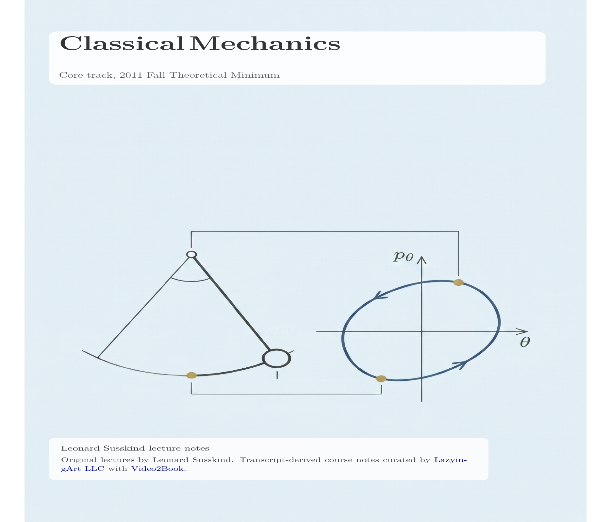</a><br>
      <strong>الميكانيكا الكلاسيكية</strong><br>
      <sub>خريف 2011 Theoretical Minimum</sub>
    </td>
    <td align="center">
      <a href="../core_classical_mechanics/2011_fall_modern_physics_stanford_partial/classical_mechanics_stanford_partial.pdf">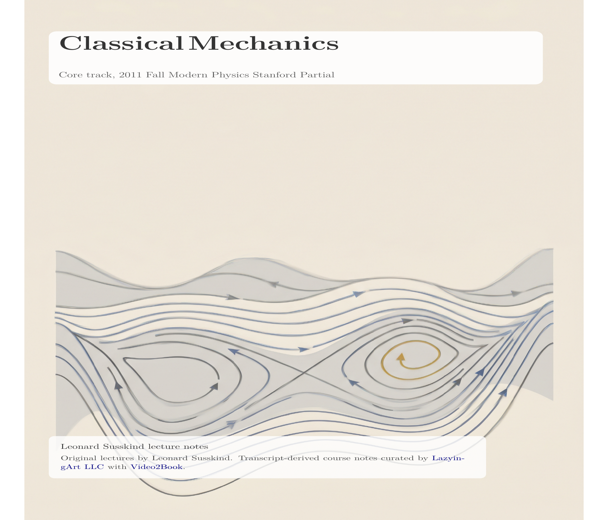</a><br>
      <strong>الميكانيكا الكلاسيكية</strong><br>
      <sub>تشغيل Stanford جزئي</sub>
    </td>
    <td align="center">
      <a href="../core_quantum_mechanics/2012_winter_theoretical_minimum/quantum_mechanics_theoretical_minimum.pdf">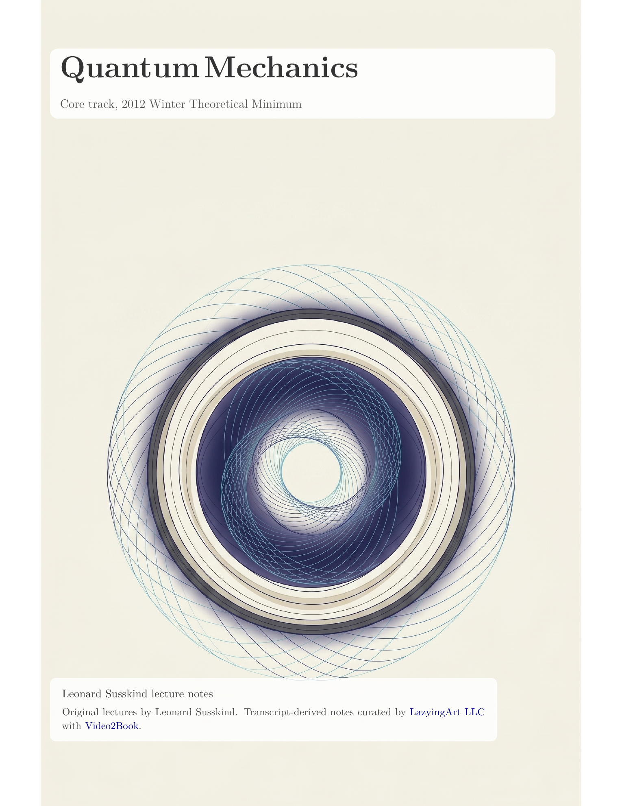</a><br>
      <strong>ميكانيكا الكم</strong><br>
      <sub>شتاء 2012 Theoretical Minimum</sub>
    </td>
    <td align="center">
      <a href="../core_quantum_mechanics/2012_winter_modern_physics_stanford/quantum_mechanics_modern_physics_stanford.pdf">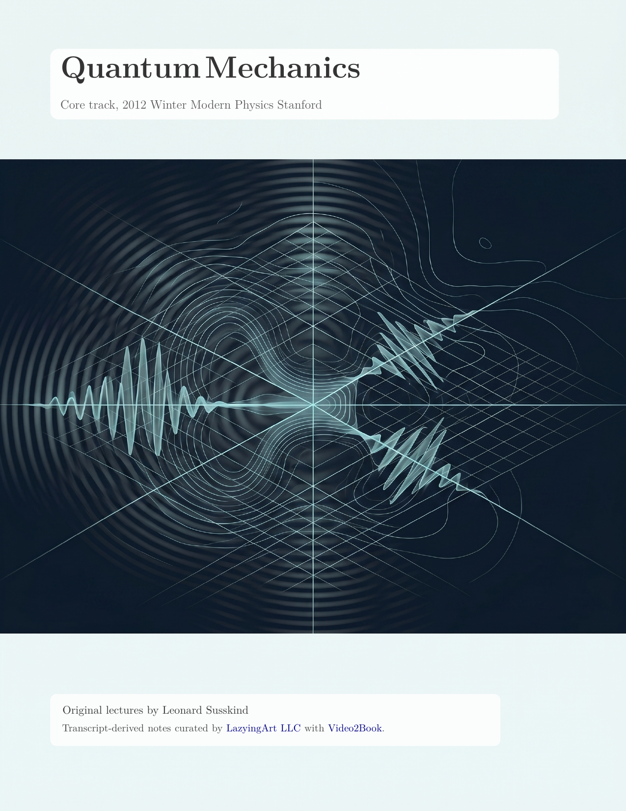</a><br>
      <strong>ميكانيكا الكم</strong><br>
      <sub>شتاء 2012 Modern Physics Stanford</sub>
    </td>
  </tr>
  <tr>
    <td align="center">
      <a href="../core_special_relativity/2012_spring_theoretical_minimum/special_relativity_theoretical_minimum.pdf">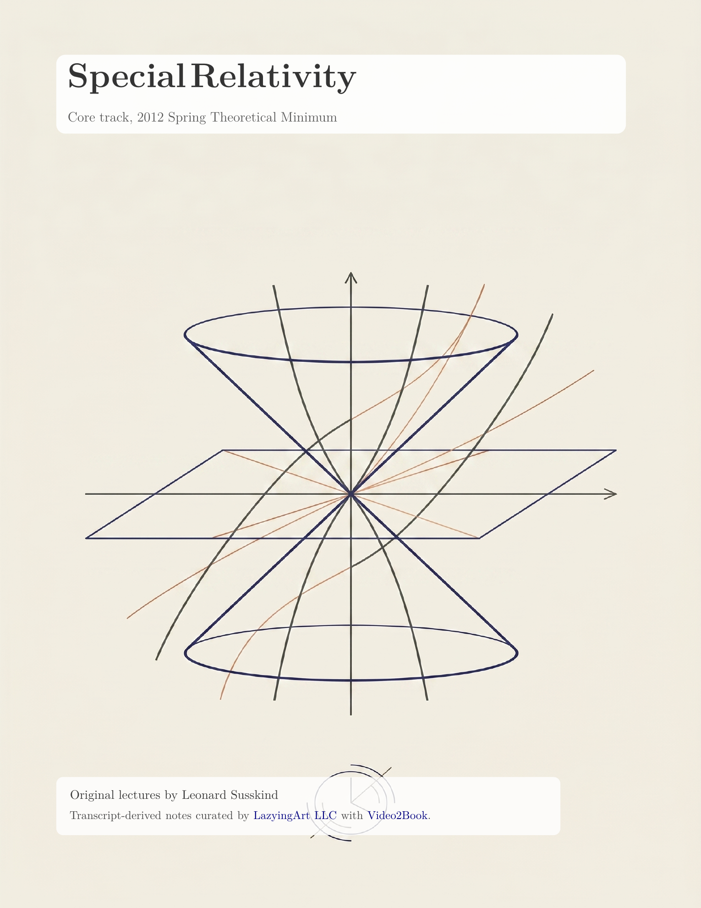</a><br>
      <strong>النسبية الخاصة</strong><br>
      <sub>ربيع 2012 Theoretical Minimum</sub>
    </td>
    <td align="center">
      <a href="../core_general_relativity/2012_fall_theoretical_minimum/general_relativity_theoretical_minimum.pdf">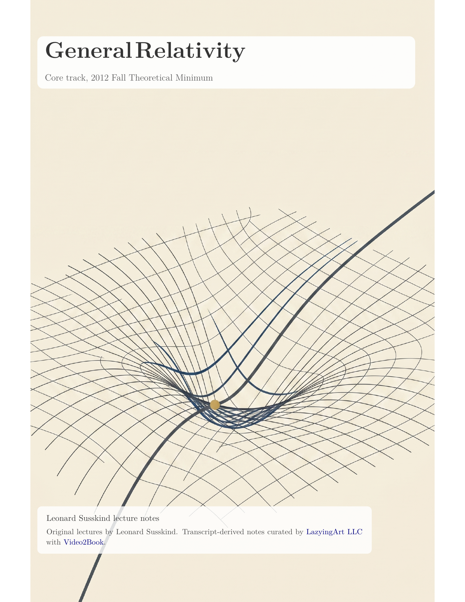</a><br>
      <strong>النسبية العامة</strong><br>
      <sub>خريف 2012 Theoretical Minimum</sub>
    </td>
    <td align="center">
      <a href="../core_general_relativity/2008_fall_einsteins_general_theory_of_relativity/general_relativity_2008_fall_einsteins_general_theory_of_relativity.pdf"></a><br>
      <strong>النسبية العامة</strong><br>
      <sub>خريف 2008 نظرية أينشتاين العامة</sub>
    </td>
    <td align="center">
      <a href="../core_statistical_mechanics/2013_spring_theoretical_minimum/statistical_mechanics_theoretical_minimum.pdf">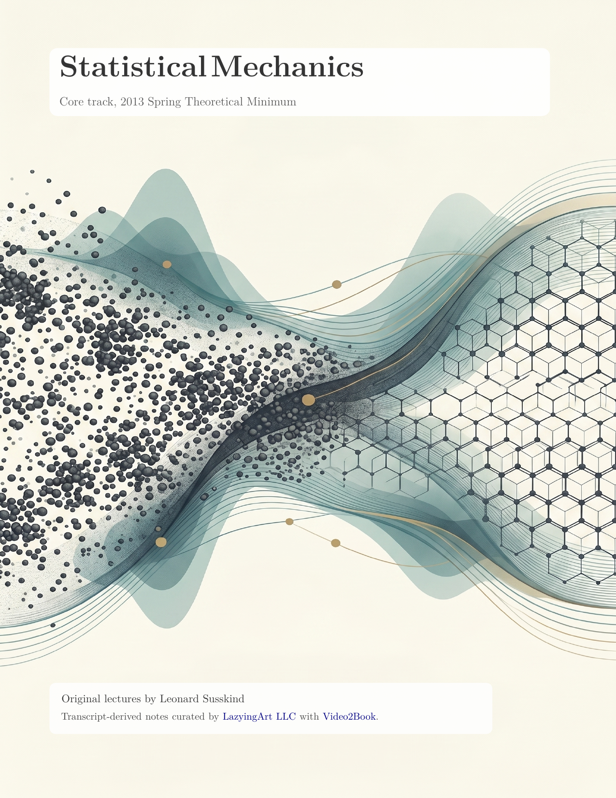</a><br>
      <strong>الميكانيكا الإحصائية</strong><br>
      <sub>ربيع 2013 Theoretical Minimum</sub>
    </td>
  </tr>
  <tr>
    <td align="center">
      <a href="../core_cosmology/2013_winter_theoretical_minimum/cosmology_theoretical_minimum.pdf">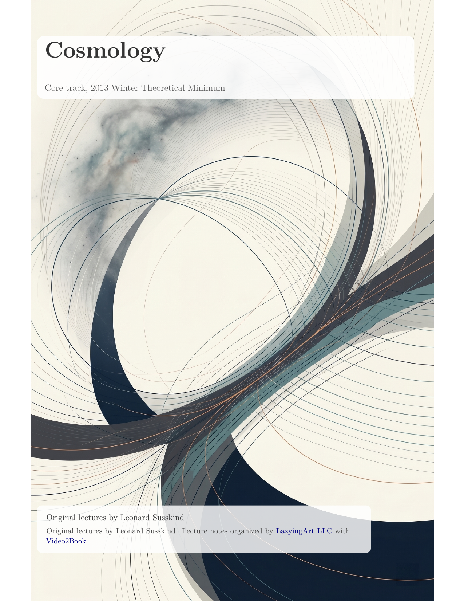</a><br>
      <strong>علم الكونيات</strong><br>
      <sub>شتاء 2013 Theoretical Minimum</sub>
    </td>
    <td align="center">
      <a href="../core_cosmology/2009_winter_legacy_cosmology/cosmology_legacy.pdf">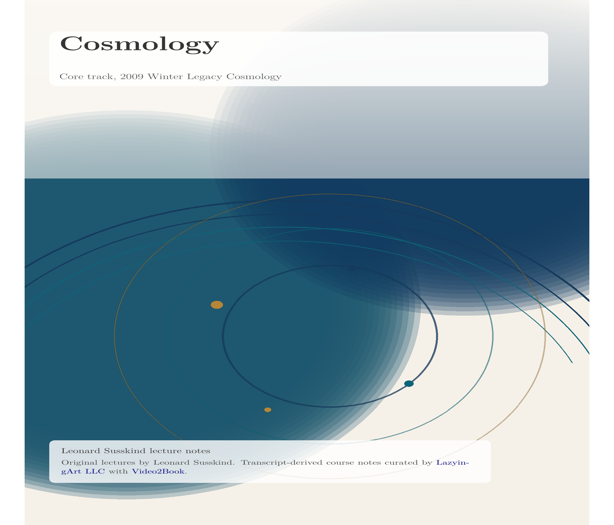</a><br>
      <strong>علم الكونيات</strong><br>
      <sub>تشغيل تراثي شتاء 2009</sub>
    </td>
    <td></td>
    <td></td>
  </tr>
  <tr>
    <td colspan="4"><strong>تكميلي</strong> · كمومي ← خاص ← عام ← إحصائي ← كوسمولوجيا</td>
  </tr>
  <tr>
    <td align="center">
      <a href="../supplemental_advanced_quantum/advanced_quantum_mechanics.pdf">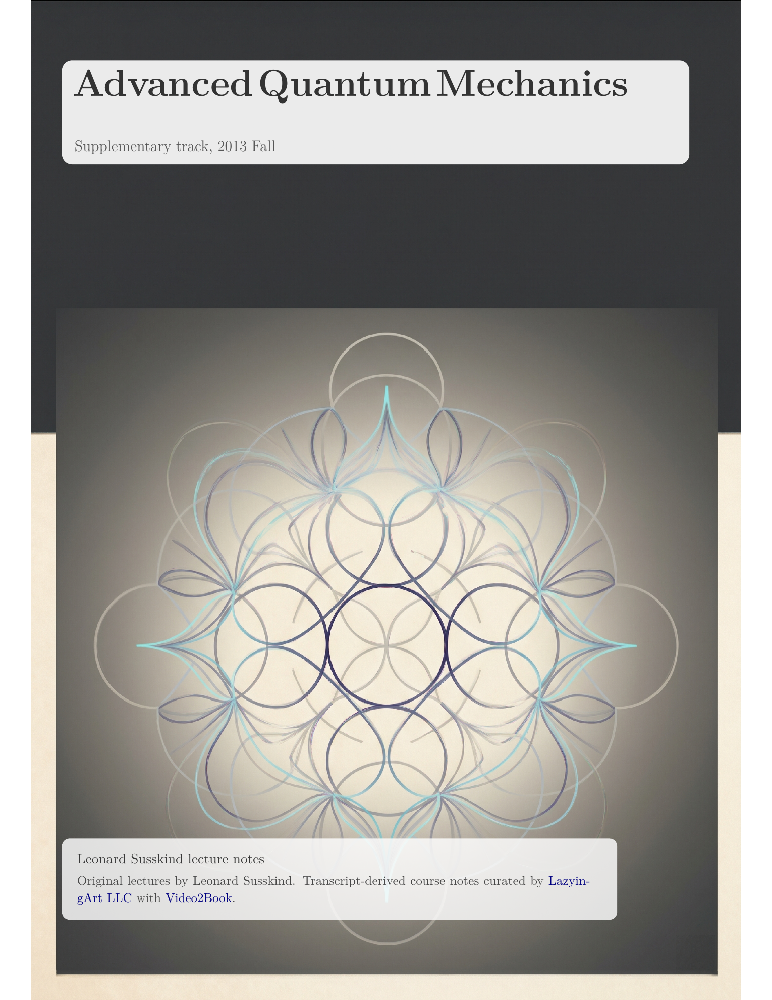</a><br>
      <strong>ميكانيكا الكم المتقدمة</strong><br>
      <sub>كتاب مقرر تكميلي</sub>
    </td>
    <td align="center">
      <a href="../supplemental_quantum_entanglement/quantum_entanglement_part_1.pdf">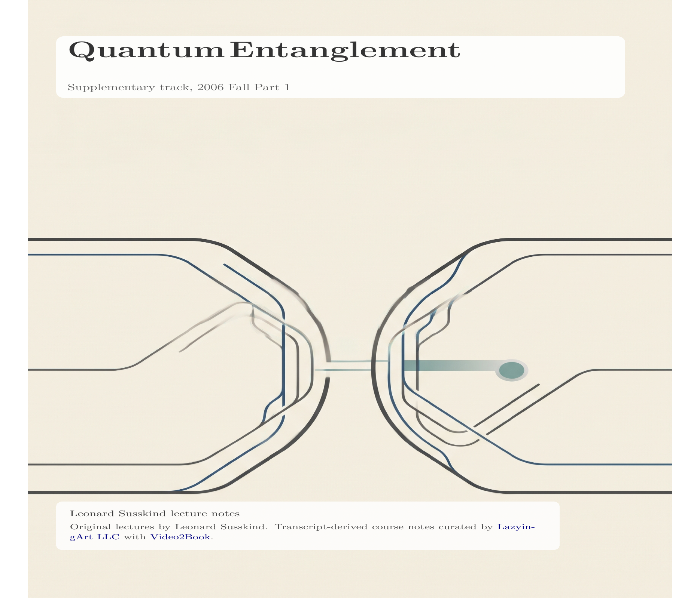</a><br>
      <strong>التشابك الكمي</strong><br>
      <sub>الجزء 1</sub>
    </td>
    <td align="center">
      <a href="../supplemental_quantum_entanglement/quantum_entanglement_part_3.pdf">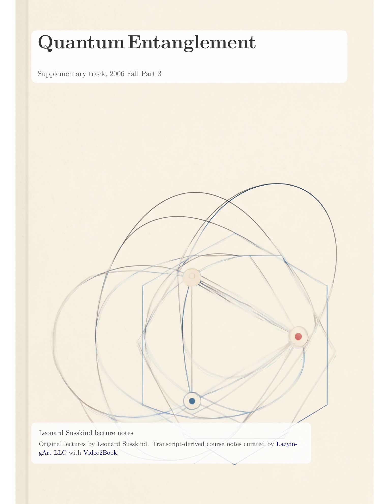</a><br>
      <strong>التشابك الكمي</strong><br>
      <sub>الجزء 3</sub>
    </td>
  </tr>
  <tr>
    <td align="center">
      <a href="../supplemental_particle_physics_1/particle_physics_1_basic_concepts.pdf">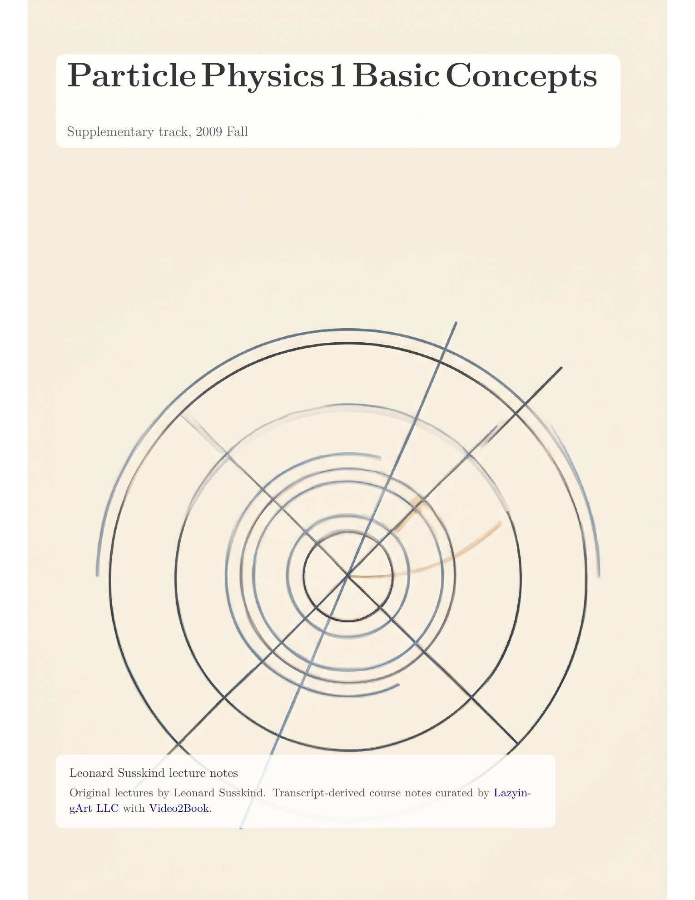</a><br>
      <strong>فيزياء الجسيمات 1</strong><br>
      <sub>المفاهيم الأساسية</sub>
    </td>
    <td align="center">
      <a href="../supplemental_particle_physics_2/particle_physics_2_standard_model.pdf">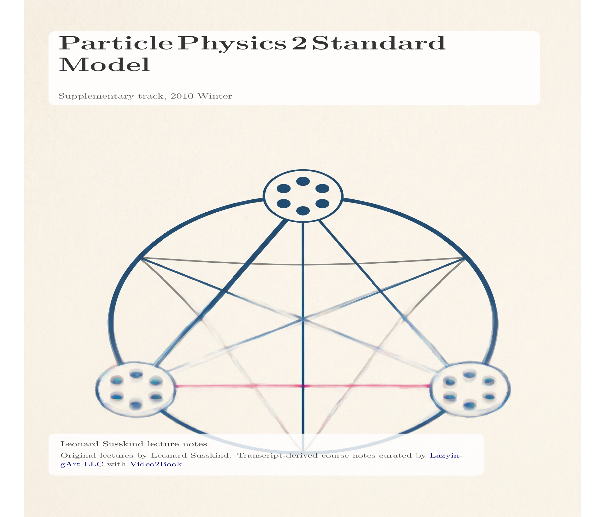</a><br>
      <strong>فيزياء الجسيمات 2</strong><br>
      <sub>النموذج المعياري</sub>
    </td>
    <td align="center">
      <a href="../supplemental_particle_physics_3/particle_physics_3_supersymmetry_and_grand_unification.pdf">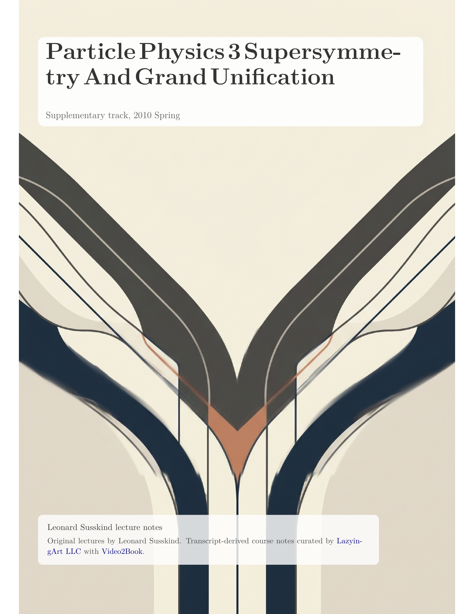</a><br>
      <strong>فيزياء الجسيمات 3</strong><br>
      <sub>التناظر الفائق والتوحيد العظيم</sub>
    </td>
  </tr>
  <tr>
    <td align="center">
      <a href="../supplemental_cosmology_and_black_holes/topics_in_string_theory.pdf"></a><br>
      <strong>موضوعات في نظرية الأوتار</strong><br>
      <sub>مجموعة الكوسمولوجيا والثقوب السوداء</sub>
    </td>
    <td align="center">
      <a href="../supplemental_string_theory/string_theory_and_m_theory.pdf">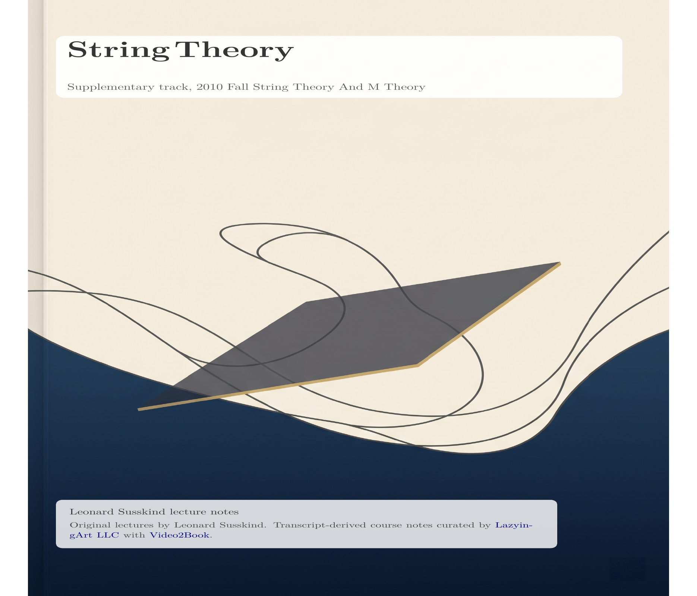</a><br>
      <strong>نظرية الأوتار وM-Theory</strong><br>
      <sub>كتاب مقرر تكميلي</sub>
    </td>
    <td align="center">
      <a href="../supplemental_higgs_boson/demystifying_the_higgs_boson.pdf">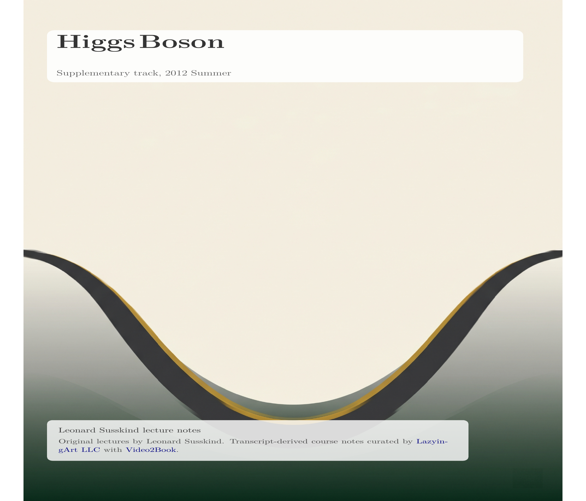</a><br>
      <strong>تبسيط بوزون هيغز</strong><br>
      <sub>كتاب لمحاضرة واحدة</sub>
    </td>
  </tr>
</table>

## ✨ ما الذي يوفّره هذا المستودع

- ملفات PDF الخاصة بالمقررات ومواد LaTeX المُدارة يدويًا الموجودة في مجلدات `core_*` و`supplemental_*`.
- طبقة تفريغ مزدوجة لأرشيف المحاضرات:
  - `subtitles/` لملفات `.srt`
  - `markdown/` للتفريغات النصية بصيغة Markdown والممهورة بالطوابع الزمنية
- خط أنابيب من النص المفرغ إلى TeX داخل `generated_course_notes/`.
- الوحدة الفرعية `Video2Book/` لتنزيل القوائم التشغيلية، والتفريغ، وأتمتة تحويل الترجمات إلى ملاحظات.
- مواد مرافقة مستوردة داخل `theoretical_minimum_companion_notes/`.
- قوالب LaTeX قابلة لإعادة الاستخدام في `template/kaobook` و`template/tuftle`.

النسخة الإنجليزية هي README المعتمد. وتوجد الترجمات في `i18n/` وقد تتأخر عن الملف الإنجليزي.

## 🎬 قائمة التشغيل المصدرية

الأرشيف الرئيسي للنصوص المفرغة وملفات الترجمة في هذا المستودع مشتق من قائمة تشغيل YouTube التالية:

- <https://www.youtube.com/playlist?list=PLERGeJGfknBTR_nXt5QL88xJF5LhDZBnG>

## 🗂️ تخطيط المستودع

<table>
  <colgroup>
    <col style="width: 33%">
    <col style="width: 33%">
    <col style="width: 34%">
  </colgroup>
  <thead>
    <tr>
      <th>📚 الطبقة</th>
      <th>📍 المسار الرئيسي</th>
      <th>🧾 ما الذي تحتويه</th>
    </tr>
  </thead>
  <tbody>
    <tr>
      <td>مجلدات المقررات المُدارة يدويًا</td>
      <td><code>core_*</code>, <code>supplemental_*</code></td>
      <td>مجلدات مقررات موجهة للقارئ، وملفات PDF منشورة، وملفات README، ومصادر LaTeX مختارة.</td>
    </tr>
    <tr>
      <td>الترجمات</td>
      <td><code>subtitles/</code></td>
      <td>ملفات ترجمة المحاضرات بصيغة <code>.srt</code>.</td>
    </tr>
    <tr>
      <td>التفريغات النصية بصيغة Markdown</td>
      <td><code>markdown/</code></td>
      <td>تفريغات محاضرات ممهورة زمنيًا تُستخدم للقراءة والبحث وتوليد الملاحظات.</td>
    </tr>
    <tr>
      <td>مصادر الملاحظات المُولَّدة</td>
      <td><code>generated_course_notes/</code></td>
      <td>فصول TeX مشتقة من التفريغات، وأشكال، وطلبات، ومواد بناء المقررات.</td>
    </tr>
    <tr>
      <td>ملفات PDF المُولَّدة والمنشورة</td>
      <td><code>supplemental_*/</code></td>
      <td>المخرجات المنشورة المعتمدة للمقررات المُولَّدة المكتملة، باستخدام اسم ملف PDF مدمج خاص بكل مقرر بالإضافة إلى ملفات <code>lecture_XX.pdf</code>.</td>
    </tr>
    <tr>
      <td>نواتج البناء القديمة</td>
      <td><code>core_cosmology/cosmology_ch10/artifacts/</code></td>
      <td>مخرجات بناء محتفظ بها للمشروع الفرعي الأقدم الخاص بالفصل العاشر من الكوسمولوجيا.</td>
    </tr>
    <tr>
      <td>الملاحظات المرافقة</td>
      <td><code>theoretical_minimum_companion_notes/</code></td>
      <td>ملاحظات TeX مرافقة مستوردة ومشتقة من مشروع <code>weka511/tm</code>.</td>
    </tr>
    <tr>
      <td>القوالب والمواد المشتركة</td>
      <td><code>template/</code>, <code>figs/</code>, <code>the_theoretical_minimum/</code>, <code>Video2Book/</code></td>
      <td>قوالب LaTeX، وهوية/أصول مشتركة، ونسخة الوحدة الفرعية ذات الصلة، ووحدة الأتمتة الخاصة بالتنزيل والتفريغ.</td>
    </tr>
  </tbody>
</table>

داخل `subtitles/` و`markdown/` و`generated_course_notes/`، تُنظَّم المواد بحسب المسار (`core/` أو `supplementary/`)، ثم الموضوع، ثم تشغيل المقرر.

بالنسبة للملاحظات المُولَّدة، يحتوي مجلد كل مقرر عادةً على:

- `chapters/` لملفات TeX الخاصة بكل محاضرة وملفات PDF الخاصة بكل محاضرة
- `figures/` لإطارات المحاضرات المستخرجة وأصول الأشكال
- `course.tex` و`course.pdf` لكتاب المقرر الكامل المدمج

## 🧭 مجلدات المقررات الجذرية

| 🏷️ المجموعة | 📂 المجلدات |
|---|---|
| أساسي | `core_classical_mechanics`, `core_quantum_mechanics`, `core_special_relativity`, `core_general_relativity`, `core_cosmology`, `core_statistical_mechanics` |
| تكميلي | `supplemental_advanced_quantum`, `supplemental_cosmology_and_black_holes`, `supplemental_higgs_boson`, `supplemental_particle_physics_1`, `supplemental_particle_physics_2`, `supplemental_particle_physics_3`, `supplemental_quantum_entanglement`, `supplemental_relativity`, `supplemental_string_theory` |

## 🚀 كيفية استخدام المستودع

### 📖 قراءة الملاحظات المنشورة

افتح ملفات PDF داخل مجلد المقرر ذي الصلة، على سبيل المثال:

- `../core_classical_mechanics/2011_fall_theoretical_minimum/classical_mechanics_theoretical_minimum.pdf`
- `../core_classical_mechanics/2011_fall_modern_physics_stanford_partial/classical_mechanics_stanford_partial.pdf`
- `../core_quantum_mechanics/2012_winter_theoretical_minimum/quantum_mechanics_theoretical_minimum.pdf`
- `../core_quantum_mechanics/2012_winter_modern_physics_stanford/quantum_mechanics_modern_physics_stanford.pdf`
- `../core_special_relativity/2012_spring_theoretical_minimum/special_relativity_theoretical_minimum.pdf`
- `../core_general_relativity/2012_fall_theoretical_minimum/general_relativity_theoretical_minimum.pdf`
- `../core_cosmology/2013_winter_theoretical_minimum/cosmology_theoretical_minimum.pdf`
- `../core_cosmology/2009_winter_legacy_cosmology/cosmology_legacy.pdf`
- `../core_statistical_mechanics/lesson_1.pdf`
- `../supplemental_advanced_quantum/advanced_quantum_mechanics.pdf`
- `../supplemental_cosmology_and_black_holes/topics_in_string_theory.pdf`
- `../supplemental_higgs_boson/demystifying_the_higgs_boson.pdf`
- `../supplemental_particle_physics_1/particle_physics_1_basic_concepts.pdf`
- `../supplemental_particle_physics_2/particle_physics_2_standard_model.pdf`
- `../supplemental_particle_physics_3/particle_physics_3_supersymmetry_and_grand_unification.pdf`
- `../supplemental_quantum_entanglement/quantum_entanglement_part_1.pdf`
- `../supplemental_quantum_entanglement/quantum_entanglement_part_3.pdf`
- `../supplemental_string_theory/string_theory_and_m_theory.pdf`

### 📝 قراءة النصوص المفرغة مباشرة

استخدم:

- `../subtitles/` للقراءة بأسلوب الترجمة والحفاظ على الدقة الزمنية
- `../markdown/` لمراجعة النص، والبحث، وتوليد الملاحظات

### ⬇️ تحديث قائمة التشغيل المصدرية

استخدم الغلاف الأب، الذي يفوض التنفيذ إلى الوحدة الفرعية `Video2Book`:

```bash
./scripts/download_susskind_playlist.sh
```

### 🎙️ تشغيل طابور التفريغ

استخدم الأغلفة الأبوية، التي تفوض التنفيذ إلى الوحدة الفرعية `Video2Book`:

```bash
./scripts/start_transcription_tmux.sh
./scripts/start_transcription_monitor_tmux.sh
```

### 🧪 العمل على الملاحظات المشتقة من النصوص المفرغة

تقع مساحة عمل الملاحظات المُولَّدة تحت:

- `../generated_course_notes/`

داخل كل تشغيل مقرر:

- يحتوي `chapters/` على مجلد واحد لكل محاضرة
- يحتوي كل مجلد محاضرة على فصل TeX الخاص بها وملف PDF المجمّع للمحاضرة
- `course.pdf` هو ملف PDF الكامل المدمج لذلك التشغيل

شغّل منسّق الملاحظات عبر الأغلفة الأبوية، التي تفوض التنفيذ إلى الوحدة الفرعية `Video2Book`:

```bash
./scripts/start_course_notes_tmux.sh
./scripts/start_course_notes_monitor_tmux.sh
```

### 📘 تصدير ملفات PDF مدمجة بصيغة الجيب

ولّد نسخًا بحجم يدوي 6x9 بوصات من ملفات LaTeX الخاصة بالمقررات المُولَّدة المكتملة:

```bash
./scripts/export_course_pocket_pdfs.sh
./scripts/export_course_pocket_pdfs.sh --size a5 --suffix a5
```

تُكتب المخرجات افتراضيًا إلى `../all_notes/pocket_books/<course>_pocket.pdf` (أسماء ملفات
معتمدة، مع لاحقة مخصصة اختيارية عبر `--suffix`).

### 📚 العمل على الملاحظات المرافقة المستوردة

```bash
./theoretical_minimum_companion_notes/build_all.sh
```

## 🤝 التعاون

نرحب بالمساهمات التي تحسّن الجودة الرياضية والوضوح وحفظ المواد الدراسية المرتبطة بـ Leonard Susskind.

تشمل مجالات الأولوية:

- تنظيف النصوص المفرغة
  - إصلاح إسناد المتحدث
  - إصلاح الطوابع الزمنية
  - تصحيح المصطلحات الفيزيائية والأسماء والرموز
- تحسين TeX
  - تحويل النصوص المفرغة إلى عرض رياضي أوضح
  - تحسين البنية والطباعة والإحالات المرجعية المتقاطعة
  - صقل الفصول المُولَّدة لتصبح ملاحظات مقررات متينة
- العمل على الأشكال والمعادلات
  - التحقق من إطارات المحاضرات المستخرجة
  - إعادة رسم المخططات باستخدام TikZ
  - تحويل معادلات السبورة إلى LaTeX موثوق
- أعمال أرشفة فيزيائية أوسع
  - تحسين المواد المرافقة لـ *Theoretical Minimum*
  - ربط محاضرات Susskind والكتب ومجموعات الملاحظات ذات الصلة
  - المساعدة في نشر هذا الجسد من تعليم الفيزياء وحفظه بمسؤولية

ينبغي أن تستخدم المساهمات التزامات مركزة وأن تحدد بدقة المجلدات أو النصوص المفرغة أو تشغيلات المقررات التي تغيرت.

## 🙏 الشكر والتقدير

- Leonard Susskind على المحتوى الأصلي للمحاضرات.
- تنسيق المستودع وأدوات النشر: [LazyingArt LLC](https://lazying.art)
- Simon Crase على مستودع الملاحظات المرافقة المستورد إلى `../theoretical_minimum_companion_notes/`.
- مستودع مصدر الملاحظات المرافقة: <https://github.com/weka511/tm>
- مصادر الملاحظات المرجعية الموجودة:
  - <https://www.lapasserelle.com/general_relativity/>
  - <https://www.lapasserelle.com/cosmology/>
  - <https://www.lapasserelle.com/statistical_mechanics/>
- ملاحظة المصدر الخاصة بمجموعات PDF الأقدم المشتقة من La Passerelle:
  - [`../references/lapasserelle_susskind_pdf_provenance.md`](../references/lapasserelle_susskind_pdf_provenance.md)

## ❤️ الدعم

| Donate | PayPal | Stripe |
| --- | --- | --- |
| [](https://chat.lazying.art/donate) | [](https://paypal.me/RongzhouChen) | [](https://buy.stripe.com/aFadR8gIaflgfQV6T4fw400) |

## الترخيص

هذا المستودع مرخّص بموجب GNU General Public License v3.0. انظر [LICENSE](../LICENSE).
